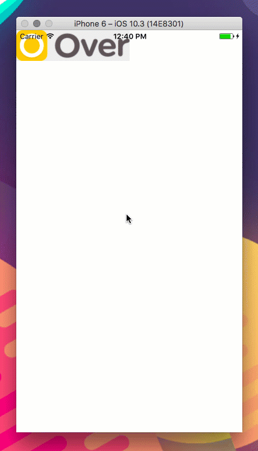

React Native Gestures
=====================

:warning: This package is still in early stage, it will have a heaps of API changes before it move to 1.0 :warning:

> React Native Composable Gesture Library

[](https://travis-ci.org/kiddkai/react-native-gestures)
[](https://npmjs.org/package/react-native-gestures "View this project on npm")
[](https://npmjs.org/package/react-native-gestures "View this project on npm")
[](https://github.com/kiddkai/react-native-gestures/pulls?q=is%3Apr+is%3Aclosed)
[](https://github.com/kiddkai/react-native-gestures/issues?q=is%3Aissue+is%3Aclosed)
[](http://standardjs.com/)


Demo
----



Getting Started
---------------

```sh
yarn add react-native-gestures
```

You can wrap elements using `GestureView`:

```js
import React, { Component } from "react"
import { Image, View } from "react-native"
import { Gestures, GestureView } from "./gestures"

const styles = {
    container: {
        backgroundColor: "white",
        flex: 1,
    },
    draggable: {
        backgroundColor: "#f0f0f0",
        position: "absolute",
        width: 188,
        height: 51,
    },
}

const App = () => (
    <View style={styles.container}>
        <GestureView
            style={styles.draggable}
            gestures={[Gestures.drag, Gestures.pinch]}
        >
            <Image pointerEvents={"none"} source={require("./sample.png")} />
        </GestureView>
    </View>
)
```

APIs
----------

### <GestureView>

As you can see, it's just a very simple React component you can use in this package, maybe
it will have more components in the future, or not.

There are few properties it accepts:

* gestures - `Array` of [gesture](#gestures)
* onLayout - mapping function that allow you to pick the changes you want to css style
* onError  - `Function` will be called when anything bad happens
* style    - `style` same as `<View>`'s `style` property
* children - ...ordinary child components

Example:

```js
const styles = {
    draggable: {
        backgroundColor: "#f0f0f0",
        position: "absolute",
        width: 188,
        height: 51,
    },
}

<GestureView
    style={styles.draggable}
    gestures={[Gestures.drag, Gestures.pinch]}
>
    <Image pointerEvents={"none"} source={require("./sample.png")} />
</GestureView>
```

### Gestures

Every gesture in this module is just a simple combination of two things:

1. A `transducer` called `calculate`(please suggest me a better name)

   This is the actual function that calculates the new positions of the view
   when the move gesture event comes in.

2. A `number` called `GESTURE_NUMBER`

   This define that the gesture will start calculate when the gesture number
   matches this number.

   You can set any number you want if your touch screen supports it :p


#### drag

It's just a simple transducer takes one finger input with the move of the
finger and generates new layout of the component.

#### pinch

It's a pinch gesture, also a zoom gesture. It takes two fingers gestures and
generates new layout of the component.
